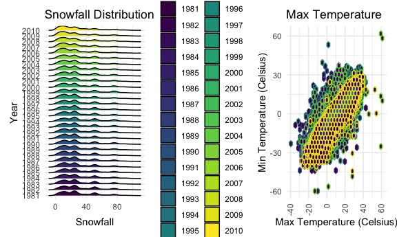

HW 3
================
Carolyn Martinez
2024-10-10

## Problem 1: NY NOAA Data

``` r
library(p8105.datasets)
data("ny_noaa")
```

The data has observations on 2595176 individual GHCND-Daily weather
stations. The data set has 7 variables some of which include the station
ID, the date of the observation, the precipitation in tenths of a mm,
the snowfall in mm, the snow depth in mm, and the max and temperature in
degrees Celsius. Missing data is a big issue considering there are
3387623 missing data in the set.

``` r
ny_noaa_clean = 
   ny_noaa |>
separate(date, into = c("year", "month", "day"), sep="-", extra = "merge", fill = "right")|>
   mutate(
      prcp = round(as.numeric(prcp, digits =0)),
      tmin = as.numeric(tmin)/10,
      tmax = as.numeric(tmax)/10,
      snow = as.numeric(snow),
      year = as.factor(year),
      month = as.numeric(month),
      day = as.numeric(day))
```

``` r
   most_common_snow=
   ny_noaa_clean|>
  group_by(snow) |> summarize(count = n(), na.rm=TRUE) |> arrange(desc(count)) 
```

The most common observed value for snow is 0 mm. This could be due to
many reasons, including because the half of the stations report
precipitation only and the record length of the stations are not
consistent which might result in some winter months being excluded.

``` r
t_max_july =
   ny_noaa_clean |> 
   filter(month==07) |>  
   group_by(id, year)|>
   summarize(mean_tmax = mean(tmax, na.rm=TRUE))|>
   ggplot(aes(x= year, y= mean_tmax, color=id))  +
                   geom_point() + 
                  geom_line() +
            labs(
               title= "Average Max Temperature in July", 
               x= "Year", 
               y= "Average Max Temperature (Celsius)") +
    theme(axis.text.x = element_text(angle = 90, vjust = 0.5, hjust = 1), legend.position = "none")
```

    ## `summarise()` has grouped output by 'id'. You can override using the `.groups`
    ## argument.

``` r
t_max_jan =
    ny_noaa_clean |> 
   filter(month==01) |>  
   group_by(id, year)|>
   summarize(mean_tmax = mean(tmax, na.rm=TRUE))|>
   ggplot(aes(x= year, y= mean_tmax, color=id))  +
                   geom_point() + 
                  geom_line() +
            labs(
               title= "Average Max Temperature in January", 
               x= "Year", 
               y= "Average Max Temperature (Celsius)") +
    theme(axis.text.x = element_text(angle = 90, vjust = 0.5, hjust = 1), legend.position = "none")
```

    ## `summarise()` has grouped output by 'id'. You can override using the `.groups`
    ## argument.

``` r
t_max_july + t_max_jan
```

    ## Warning: Removed 3047 rows containing missing values or values outside the scale range
    ## (`geom_point()`).

    ## Warning: Removed 3047 rows containing missing values or values outside the scale range
    ## (`geom_line()`).

    ## `geom_line()`: Each group consists of only one observation.
    ## ℹ Do you need to adjust the group aesthetic?

    ## Warning: Removed 2923 rows containing missing values or values outside the scale range
    ## (`geom_point()`).

    ## Warning: Removed 2923 rows containing missing values or values outside the scale range
    ## (`geom_line()`).

    ## `geom_line()`: Each group consists of only one observation.
    ## ℹ Do you need to adjust the group aesthetic?


The structure of the data is tidy but not for a lay audience. This is
noticeable based on the dense overlay of stations. In July there is one
clear outlier in the 1988 and another in January in 1982. The structure
of the data is somewhat interpretable, it might be best to group by the
location of the station as opposed to the station ID to clean up the
aesthetics.

``` r
tmaxvtmin_plot =
    ny_noaa_clean |> 
   group_by(id) |>
   ggplot(aes(x= tmax, y=tmin, color=id)) +
                  geom_hex() +
            labs(
               title= "Max vs. Min Temperature", 
               x= "Max Temperature (Celsius)", 
               y= "Min Temperature (Celsius)") +
    theme(axis.text.x = element_text(angle = 90, vjust = 0.5, hjust = 1), legend.position = "none")
```

``` r
snow_plot =
    ny_noaa_clean |> 
   filter(snow > 0 & snow < 100) |>
ggplot(aes(x = snow, y = year)) + 
  geom_density_ridges(scale=0.85, color = "black") +
   labs(
      title = "Snowfall Distribution",
      x = "Snowfall",
      y = "Year")+
      theme_minimal()

snow_plot + tmaxvtmin_plot
```

    ## Picking joint bandwidth of 3.76

    ## Warning: Removed 1136276 rows containing non-finite outside the scale range
    ## (`stat_binhex()`).



## Problem 2:Accelerometers

``` r
nhanes_demo = read_csv("./nhanes_covar.csv", 
                       skip=4, 
                       na = c(".", "NA", ""),
col_types=cols(
      `SEQN` = col_character(),
      `sex` = col_character(),
      `age`= col_number(),
      `BMI`=col_factor(),
      `education`=col_character()
      
      ))|>
   
   janitor::clean_names()
   
nhanes_acce=read_csv("./nhanes_accel.csv", na = c(".", "NA", ""),
col_types=cols(
      `SEQN` = col_character()))|>
   janitor::clean_names()

full_nhanes = left_join(nhanes_acce, nhanes_demo, by = "seqn") |>
   drop_na(seqn, sex, age, bmi, education) |>
   filter( age > 21)|>
   mutate(
      sex=recode(sex, '1' = "Male", '2' = "Female"),
      education = recode(education, '1' = "LessHS", '2' = "HS", '3' = "HSMore")
   )
```

``` r
full_nhanes |>
   drop_na(education)|>
  group_by(education, sex) |>
  summarize(count = n())|>
   pivot_wider(
       names_from = sex,
       values_from = count)  |>
   knitr::kable(caption= "Number of Men and Women per Education Category")
```

    ## `summarise()` has grouped output by 'education'. You can override using the
    ## `.groups` argument.

| education | Female | Male |
|:----------|-------:|-----:|
| HS        |     23 |   34 |
| HSMore    |     59 |   54 |
| LessHS    |     28 |   27 |

Number of Men and Women per Education Category

``` r
menvwomen_plot=
full_nhanes |>
  drop_na(education)|>
  group_by(education, sex) |>
ggplot(aes(x = age, y = education, fill =sex)) + 
  geom_density_ridges(alpha=.5, scale=0.85, color = "blue") +
   labs(
      title = "Age Distributions of Men and Women by Education Levels",
      x = "Age",
      y = "Education Level")

menvwomen_plot
```

    ## Picking joint bandwidth of 8


For participants with an education level of less than high school, there
is a slightly bimodal age distribution for men, and a unimodal one for
females that is left-skewed. For participants with an education level
higher than high school, there is a prominent right-skewed age
distribution for females and a slightly bimodal age distribution for
males. For participants with a high school equivalent level of
education, there is a left-skewed age distribution for females and a
slightly bimodal age distribution for men.

``` r
activity_plots=
   full_nhanes |>
  mutate(
     total_activity = as.numeric(rowSums(pick(min1:min1440), na.rm = TRUE)))|>
   ggplot(aes(x = age, y = total_activity))+
   geom_point(aes(color=sex), alpha=.5)+
   geom_smooth(aes(color=sex),se=FALSE)+
   labs(
      title = "Activity Levels Across Age for Males and Females by Education Level",
      x = "Age",
      y = "Total Activity (MMS)")+
      theme(axis.text.x = element_text(angle = 90, vjust = 0.5, hjust = 1))+
   facet_wrap(~education)

activity_plots
```

    ## `geom_smooth()` using method = 'loess' and formula = 'y ~ x'


This plot demonstrates higher levels of activity in younger females with
a high school level education compared to males. Additionally, for
individuals with high school level of education and higher, females
generally had higher levels of activity. The group where this pattern
diverges is for those with less than high school level of education.

``` r
daily_plots =
   full_nhanes |>
   
   pivot_longer(cols = starts_with("min"),  
                 names_to = "minute", 
                 values_to = "activity") |>
   
    mutate(minute = as.numeric(sub("min", "", minute)))|>
   
   ggplot(aes(x = minute, y = activity, color=sex))+
   geom_smooth(aes(color=sex), alpha=.3)+
   labs(
      title = "24-Hour Activity Time Courses by Education Level and Sex",
      x = "Minute of the Day",
      y = "Total Activity")+
   facet_wrap(~education)+
   theme(axis.text.x = element_text(angle = 90, vjust = 0.5, hjust = 1))

daily_plots
```

    ## `geom_smooth()` using method = 'gam' and formula = 'y ~ s(x, bs = "cs")'


Based on the created plots, most people have higher levels of activity
in the middle minutes of the day which makes sense becasue the early
minutes are midnight and beyond. There are no major differences between
education groups and for most except, the group with less than a high
school level of education, females have higher levels of activity
throughout the day.

## Problem 3: Citi Bikes

``` r
citibikes_jan2020 = read_csv("./citibike/Jan 2020 Citi.csv",
                       na = c(".", "NA", ""))|>
   janitor::clean_names()|>
   mutate(
      year="2020",
      month="January")
```

    ## Rows: 12420 Columns: 7
    ## ── Column specification ────────────────────────────────────────────────────────
    ## Delimiter: ","
    ## chr (6): ride_id, rideable_type, weekdays, start_station_name, end_station_n...
    ## dbl (1): duration
    ## 
    ## ℹ Use `spec()` to retrieve the full column specification for this data.
    ## ℹ Specify the column types or set `show_col_types = FALSE` to quiet this message.

``` r
citibikes_july2020 = read_csv("./citibike/July 2020 Citi.csv",
                       na = c(".", "NA", ""))|>
   janitor::clean_names()|>
   mutate(
      year="2020",
      month="July")
```

    ## Rows: 21048 Columns: 7
    ## ── Column specification ────────────────────────────────────────────────────────
    ## Delimiter: ","
    ## chr (6): ride_id, rideable_type, weekdays, start_station_name, end_station_n...
    ## dbl (1): duration
    ## 
    ## ℹ Use `spec()` to retrieve the full column specification for this data.
    ## ℹ Specify the column types or set `show_col_types = FALSE` to quiet this message.

``` r
citibikes_jan2024 = read_csv("./citibike/Jan 2024 Citi.csv",
                       na = c(".", "NA", ""))|>
   janitor::clean_names()|>
   mutate(
      year="2024",
      month="January")
```

    ## Rows: 18861 Columns: 7
    ## ── Column specification ────────────────────────────────────────────────────────
    ## Delimiter: ","
    ## chr (6): ride_id, rideable_type, weekdays, start_station_name, end_station_n...
    ## dbl (1): duration
    ## 
    ## ℹ Use `spec()` to retrieve the full column specification for this data.
    ## ℹ Specify the column types or set `show_col_types = FALSE` to quiet this message.

``` r
citibikes_july_2024 = read_csv("./citibike/July 2024 Citi.csv",
                       na = c(".", "NA", ""))|>
   janitor::clean_names()|>
   mutate(
      year="2024",
      month="July")
```

    ## Rows: 47156 Columns: 7
    ## ── Column specification ────────────────────────────────────────────────────────
    ## Delimiter: ","
    ## chr (6): ride_id, rideable_type, weekdays, start_station_name, end_station_n...
    ## dbl (1): duration
    ## 
    ## ℹ Use `spec()` to retrieve the full column specification for this data.
    ## ℹ Specify the column types or set `show_col_types = FALSE` to quiet this message.

``` r
citibike_all=
   bind_rows(citibikes_jan2020, citibikes_jan2024, citibikes_july_2024,citibikes_july2020)
```

Total Rides by Membership

``` r
citibike_all |>
   drop_na(member_casual)|>
  group_by(member_casual, year, month) |>
  summarize(count = n())|>
   pivot_wider(
       names_from = member_casual,
       values_from = count)  |>
   knitr::kable(caption= "Total Cases by Membership and Year and Month Combination")
```

    ## `summarise()` has grouped output by 'member_casual', 'year'. You can override
    ## using the `.groups` argument.

| year | month   | casual | member |
|:-----|:--------|-------:|-------:|
| 2020 | January |    984 |  11436 |
| 2020 | July    |   5637 |  15411 |
| 2024 | January |   2108 |  16753 |
| 2024 | July    |  10894 |  36262 |

Total Cases by Membership and Year and Month Combination

Based on the above table, we can see that in 2020 most of the rides were
from members. However, in 2024, there was a higher proportion of casual
riders but most of the riders were members.

``` r
citibike_all |>
   drop_na(start_station_name)|>
   filter(
      month=="July" & year=="2024")|>
  group_by(start_station_name) |>
  summarize(count = n())|>
   arrange(desc(count)) |>  
  slice_head(n = 5) |>     
   knitr::kable(caption= "Most Popular Starting Station in July 2024")
```

| start_station_name       | count |
|:-------------------------|------:|
| Pier 61 at Chelsea Piers |   163 |
| University Pl & E 14 St  |   155 |
| W 21 St & 6 Ave          |   152 |
| West St & Chambers St    |   150 |
| W 31 St & 7 Ave          |   146 |

Most Popular Starting Station in July 2024

``` r
median_durationplot_month =
   citibike_all |>
   group_by(year, month, weekdays) |>
 summarize(median_duration=median(as.numeric(duration),.groups="drop"))|>
   ggplot(aes(x = month, y = median_duration)) +
   geom_bar(stat = "identity", position = "dodge") +
    labs(
       title = "Impact of Month on Median Duration",
        x = "Month",
        y = "Median Duration")+
      theme(axis.text.x = element_text(angle = 90, vjust = 0.5, hjust = 1))
```

    ## `summarise()` has grouped output by 'year', 'month'. You can override using the
    ## `.groups` argument.

``` r
median_durationplot_day =
   citibike_all |>
   group_by(year, month, weekdays) |>
 summarize(median_duration=median(as.numeric(duration),.groups="drop"))|>
   ggplot(aes(x = weekdays, y = median_duration)) +
   geom_bar(stat = "identity", position = "dodge") +
    labs(
       title = "Impact of Day of the Week on Median Duration",
        x = "Weekday",
        y = "Median Duration")+
      theme(axis.text.x = element_text(angle = 90, vjust = 0.5, hjust = 1))
```

    ## `summarise()` has grouped output by 'year', 'month'. You can override using the
    ## `.groups` argument.

``` r
median_durationplot_year =
   citibike_all |>
   group_by(year, month, weekdays) |>
 summarize(median_duration=median(as.numeric(duration),.groups="drop"))|>
   ggplot(aes(x = year, y = median_duration)) +
   geom_bar(stat = "identity", position = "dodge") +
    labs(
       title = "Impact of Month on Median Duration",
        x = "Year",
        y = "Median Duration")+
      theme(axis.text.x = element_text(angle = 90, vjust = 0.5, hjust = 1))
```

    ## `summarise()` has grouped output by 'year', 'month'. You can override using the
    ## `.groups` argument.

``` r
median_durationplot_month + median_durationplot_day + median_durationplot_year
```


Based on this figure, it seems the Month and the years have the largest
impact on the median ride duration. The median ride duration in January
was much lower than in July. The median ride duration was higher in 2020
than in 2024 but it was not a drastic visual difference. The yearly
difference might be explained by the COVID-19 pandemic, where people
preferred bikes over public transportation. The differences between the
two months may be explained by weather and users preferring to ride
bikes in the summer instead of the winter.

``` r
duration_distribution =
    citibike_all |> 
 filter(year== 2024)|>
ggplot(aes(x = month, y = duration, fill = rideable_type)) + 
  geom_boxplot() +
   facet_wrap(~ member_casual)+
   labs(
      title = "Ride Duration Distribution by Month in 2024",
      x = "Month",
      y = "Ride Duration") +
      theme_minimal()

duration_distribution
```


Based on this visualization, we can see that the distribution of ride
duration among casual users that used a classic bike is larger than
those that used electric bikes in both months. The distribution of ride
duration among members is smaller with no visually significant
differences between rides done on classic bikes as opposed to electric
ones in both months. The larger duration distribution seen among casual
users that used a classic bike makes sense because casual users a random
sample of bikers with varying levels of biking speed. The smaller
duration distribution closer to shorter rides among the members makes
sense because this pool of rides might be from a sample pool that is
biased toward regular bikers.
