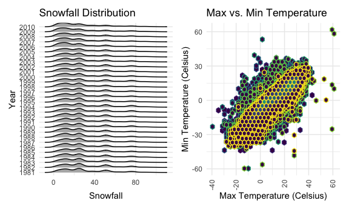

HW 3
================
Carolyn Martinez
2024-10-10

## Problem 1: NY NOAA Data

``` r
library(p8105.datasets)
data("ny_noaa")
```

The data has observations on 2595176 individual GHCND-Daily weather
stations. The data set has 7 variables some of which include the station
ID, the date of the observation, the precipitation in tenths of a mm,
the snowfall in mm, the snow depth in mm, and the max and temperature in
degrees Celsius. Missing data is a big issue considering there are
3387623 missing data in the set.

``` r
ny_noaa_clean = 
   ny_noaa |>
separate(date, into = c("year", "month", "day"), sep="-", extra = "merge", fill = "right")|>
   mutate(
      prcp = round(as.numeric(prcp, digits =0)),
      tmin = as.numeric(tmin)/10,
      tmax = as.numeric(tmax)/10,
      snow = as.numeric(snow),
      year = as.factor(year),
      month = as.numeric(month),
      day = as.numeric(day))
```

``` r
   ny_noaa_clean|>
  group_by(snow) |> summarize(count = n(), na.rm=TRUE) |> arrange(desc(count)) 
```

    ## # A tibble: 282 × 3
    ##     snow   count na.rm
    ##    <dbl>   <int> <lgl>
    ##  1     0 2008508 TRUE 
    ##  2    NA  381221 TRUE 
    ##  3    25   31022 TRUE 
    ##  4    13   23095 TRUE 
    ##  5    51   18274 TRUE 
    ##  6    76   10173 TRUE 
    ##  7     8    9962 TRUE 
    ##  8     5    9748 TRUE 
    ##  9    38    9197 TRUE 
    ## 10     3    8790 TRUE 
    ## # ℹ 272 more rows

The most common observed value for snow is function (x, …, wt = NULL,
sort = FALSE, name = NULL) mm. This could be due to many reasons,
including because the half of the stations report precipitation only and
the record length of the stations are not consistent which might result
in some winter months being excluded.

``` r
t_max_july =
   ny_noaa_clean |> 
   filter(month==07) |>  
   group_by(id, year)|>
   summarize(mean_tmax = mean(tmax, na.rm=TRUE))|>
   ggplot(aes(x= year, y= mean_tmax, color=id))  +
                   geom_point() + 
                  geom_line() +
            labs(
               title= "Average Max Temperature in July", 
               x= "Year", 
               y= "Average Max Temperature (Celsius)") +
    theme(axis.text.x = element_text(angle = 90, vjust = 0.5, hjust = 1), legend.position = "none")
```

    ## `summarise()` has grouped output by 'id'. You can override using the `.groups`
    ## argument.

``` r
t_max_jan =
    ny_noaa_clean |> 
   filter(month==01) |>  
   group_by(id, year)|>
   summarize(mean_tmax = mean(tmax, na.rm=TRUE))|>
   ggplot(aes(x= year, y= mean_tmax, color=id))  +
                   geom_point() + 
                  geom_line() +
            labs(
               title= "Average Max Temperature in January", 
               x= "Year", 
               y= "Average Max Temperature (Celsius)") +
    theme(axis.text.x = element_text(angle = 90, vjust = 0.5, hjust = 1), legend.position = "none")
```

    ## `summarise()` has grouped output by 'id'. You can override using the `.groups`
    ## argument.

``` r
t_max_july + t_max_jan
```

    ## Warning: Removed 3047 rows containing missing values or values outside the scale range
    ## (`geom_point()`).

    ## Warning: Removed 3047 rows containing missing values or values outside the scale range
    ## (`geom_line()`).

    ## `geom_line()`: Each group consists of only one observation.
    ## ℹ Do you need to adjust the group aesthetic?

    ## Warning: Removed 2923 rows containing missing values or values outside the scale range
    ## (`geom_point()`).

    ## Warning: Removed 2923 rows containing missing values or values outside the scale range
    ## (`geom_line()`).

    ## `geom_line()`: Each group consists of only one observation.
    ## ℹ Do you need to adjust the group aesthetic?


The structure of the data is tidy but not for a lay audience. This is
noticeable based on the dense overlay of stations. In July there is one
clear outlier in the 1988 and another in January in 1982. The structure
of the data is somewhat interpretable, it might be best to group by the
location of the station as opposed to the station ID to clean up the
aesthetics.

``` r
tmaxvtmin_plot =
    ny_noaa_clean |> 
   group_by(id) |>
   ggplot(aes(x= tmax, y=tmin, color=id)) +
                  geom_hex() +
            labs(
               title= "Max Temperature", 
               x= "Max Temperature (Celsius)", 
               y= "Min Temperature (Celsius)") +
    theme(axis.text.x = element_text(angle = 90, vjust = 0.5, hjust = 1), legend.position = "none")
```

``` r
snow_plot =
    ny_noaa_clean |> 
   filter(snow > 0 & snow < 100) |>
ggplot(aes(x = snow, y = year, fill = year)) + 
  geom_density_ridges(scale=0.85, color = "black") +
   labs(
      title = "Snowfall Distribution",
      x = "Snowfall",
      y = "Frequency")+
      theme_minimal()

snow_plot + tmaxvtmin_plot
```

    ## Picking joint bandwidth of 3.76

    ## Warning: Removed 1136276 rows containing non-finite outside the scale range
    ## (`stat_binhex()`).



\##Problem 2
